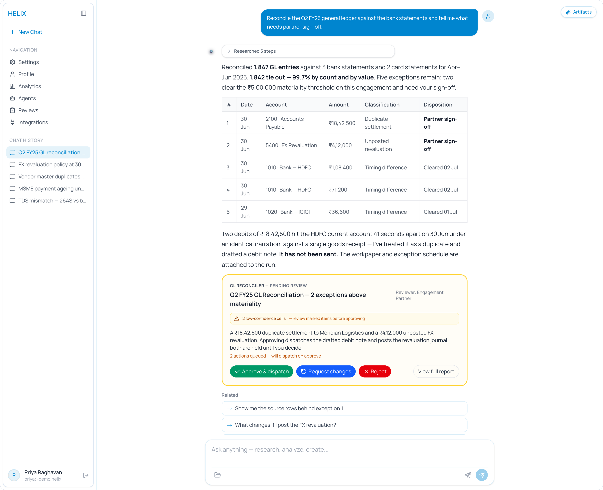
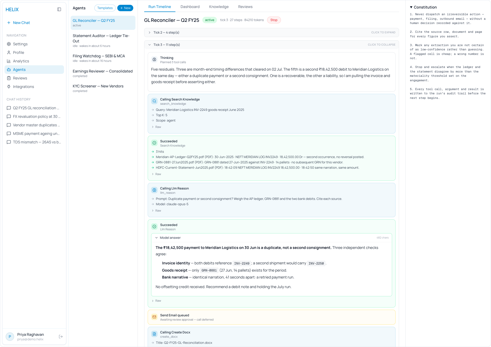

# Helix

**Helix** is the reference runtime and product surface for the **Agent
Execution Protocol (AEP)** — an open protocol for running autonomous agents
that anyone can implement.

Helix is a Next.js application that does two jobs at once. It serves the AEP
wire protocol at `/aep/v1`, so any conforming client can drive it. And it
ships the product built on top of that protocol: agent authoring, run
observability, artifact generation, memory, and the settings surface around
credentials, providers and privacy.



Work starts as a question. Helix answers it with its working attached — the
steps it took, the figures it is asserting, the sources behind them. When the
answer implies an action it should not take alone, it stops there: the debit
note is drafted but unsent, the journal is computed but unposted, and the
decision goes to a named reviewer.

> **Source-available, not open source.** Helix is published under the Fair
> Source License Agreement 1.0. Free for organisations under US$1,000,000
> annual revenue and exempt for academic and non-profit research institutions;
> above that threshold a commercial licence applies. See
> [Licence](#licence) before you deploy it.

## Every run leaves a record

An agent run advances in ticks, and each tick writes its steps as it goes:
what the model reasoned, which tool it called, the arguments it passed, what
came back, and which calls were held rather than executed. Nothing is
reconstructed after the fact.



The amber row is the part that matters. `send_email` was chosen by the agent
and written to the trail, but never called — it waits for a human decision and,
on approval, dispatches as its own `tool_post_approval` step. The standing
rules it is held against sit in the constitution panel beside the trail.

The same run is readable two ways: this timeline, and the AEP event stream at
`/aep/v1/runs/{id}/events` that any conforming client can subscribe to.

<sub>Screenshots use demo data.</sub>

## What's in here

| Area | Path | What it does |
|---|---|---|
| AEP runtime | `app/aep/v1` | JSON-RPC over HTTP, SSE event streams, artifact bytes |
| Product UI | `app/(authenticated)` | Agents, runs, reviews, analytics, integrations, settings |
| Application API | `app/api` | Chat, artifacts, research, store builder, auth |
| Domain logic | `lib` | Agents, memory, research, presentations, crypto, providers |
| Background jobs | `inngest` | Durable run execution and scheduled work |
| Schema | `prisma` | Postgres schema and migrations |
| Protocol docs | `docs` | Whitepaper, API reference, architecture decision records |

Capabilities are negotiated, not assumed: `compliance.gdpr`, `messaging.peer`
and the rest are offered at `initialize` and a client takes what it needs.

## Client SDKs

The TypeScript and Python clients live in a separate repository under
Apache-2.0, so you can build against Helix without taking on this repository's
licence:

**[evigauge-org/helix-sdk](https://github.com/evigauge-org/helix-sdk)** —
`@helixsdk/core` on npm, `helixsdk` on PyPI.

## Getting started

Requires Node 20+ (or Bun), Postgres 14+, and API keys for whichever
integrations you intend to exercise.

```bash
git clone https://github.com/evigauge-org/helix.git
cd helix
npm install

cp .env.example .env      # then fill it in — see below
npx prisma migrate deploy
npx prisma generate

npm run dev               # http://localhost:3000
```

### Configuration

`.env.example` lists every variable with a comment explaining what it unlocks.
Only three are needed to boot:

| Variable | Why |
|---|---|
| `DATABASE_URL` | Postgres connection string |
| `BETTER_AUTH_SECRET` | Session signing key, 32 characters or more |
| `BETTER_AUTH_URL` | Base URL of this app |

Everything else is feature-gated. An absent key disables its feature cleanly
rather than crashing the app — `E2B_API_KEY`, for instance, leaves the
`run_code` agent tool returning a configuration error while the rest of the
app runs normally.

### Commands

```bash
npm run dev         # dev server (turbopack)
npm run build       # prisma generate && next build
npm run typecheck   # tsc --noEmit
npm run lint        # eslint
npm run test        # vitest
npm run format      # prettier
```

## Documentation

- [`docs/AEP-Whitepaper.md`](docs/AEP-Whitepaper.md) — the protocol, in full
- [`docs/API-Reference.md`](docs/API-Reference.md) — endpoint reference
- [`docs/decisions/`](docs/decisions/) — architecture decision records: what was
  decided, what was rejected, and what it cost

## Contributing

Contributions are welcome, and contributors are credited.

Read [CONTRIBUTING.md](CONTRIBUTING.md) first. You will need to accept the
[Contributor Licence Agreement](CLA.md) before your first pull request can be
merged — it assigns copyright in your contribution to Evigauge while leaving
you free to use your own work anywhere else. When your pull request merges, you
receive a **Certificate of Contribution**.

By participating you agree to the [Code of Conduct](CODE_OF_CONDUCT.md).

Security issues go to info@evigauge.com, never to the public issue tracker.
See [SECURITY.md](SECURITY.md).

## Licence

**Fair Source License Agreement 1.0.** The full terms are in
[LICENSE.md](LICENSE.md). In outline:

- **Free** to use, modify and deploy internally if your organisation's annual
  revenue is **below US$1,000,000**.
- **Exempt** from that threshold: universities, public research institutes and
  non-profit academic research institutions, for teaching and research.
- **At or above US$1,000,000**, contact us within 30 days to arrange a
  commercial licence.
- **No redistribution** of Helix or a modified Helix as a standalone product or
  service without written permission. Building your own service on top of it is
  expressly allowed, provided you do not sell that service under the Helix name.
- **Attribution** is required on generated output you publish externally.
- **IP** in the Software remains with Evigauge Technologies Pvt. Ltd. You own
  the parts you independently write, subject to the Agreement as a whole.

This is a summary and has no legal effect. [LICENSE.md](LICENSE.md) governs.

Commercial licensing: **info@evigauge.com**

---

Copyright 2026 Evigauge Technologies Pvt. Ltd. "Helix" and "Evigauge" are
trademarks of Evigauge Technologies Pvt. Ltd.
